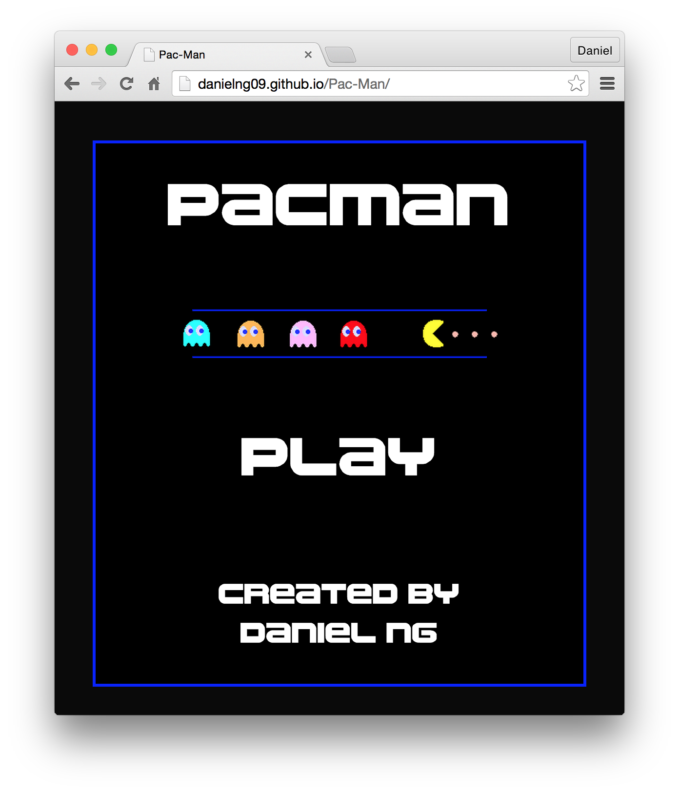

# Pac-Man

[Live Link](http://danielng09.github.io/Pac-Man/)

A browser version of the iconic arcade game. Built with Phaser, a HTML5 game framework, and JavaScript.

## Feature Highlights

* Pac-Man and ghosts move around the board with appropriate sounds and animations.
* Ghost AI keeps track of all possible valid moves and randomly selects a new direction.
* Dynamically updates score as Pac-Man swallows dots
* Pac-Man can teleport from one edge of the board to the other
